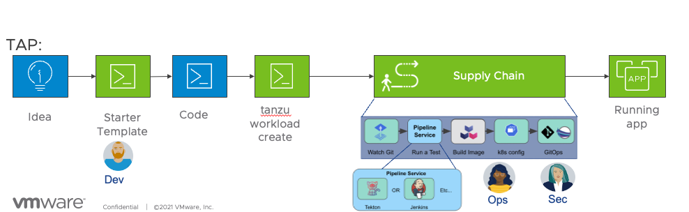

Development Team 

- Download code from Accelerator 
- Update User Interface of the application
- Test it Locally  
- Checkin the code to Git

Ops Team 

- Create workload object  
- Watch Supplychain execution using UI and with Kubectl

Security Team

- Validate scan result and Scan Policy
